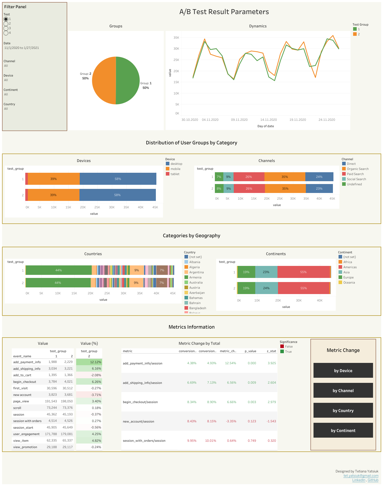

# 🧪 A/B Test Result Analysis

This project focuses on analyzing A/B test results using statistical methods in **Python** and visualizing the findings in **Tableau**.

**Data Source**: [ab_test_data.csv](ab_test_data.csv) (data gained from BigQuery by [SQL query](SQL_Query))

🛠️ **Tools Used**: Python (google.colab, pandas, numpy, statistics), Tableau.

## 🎯 Objectives

### **Developing a Universal Statistical Significance Calculator**
Create a flexible Python script to calculate statistical significance for A/B test metrics.  
Uses arrays and loops to handle **any number of metrics**, avoiding hardcoded logic.

### 📊 **Analyzing Conversion Metrics**
Calculate significance for key performance metrics:  
- `add_payment_info / session`  
- `add_shipping_info / session`  
- `begin_checkout / session`  
- `new_accounts / session`  
- `session_with_orders / session`

### 🔍 **Perform Analysis by Segments**
Compute statistical significance not only for the overall test but also across all possible segments:  
- By **test number**  
- By **country**  
- By **device type**  
…and other available segments to provide comprehensive insights.

### 💾 **Saving Results**
Export a clean `.csv` file containing all necessary data for visualization, including calculated metrics, Z-statistics, P-values, and significance.  
Results include a table with columns:  
 `"test_number" | "segmentation_by" | "segment" | "metric" | "numerator_event" | "denominator_event" | "numerator_count_a" | "denominator_count_a" | "conversion_rate_a" | "numerator_count_b" | "denominator_count_b" | "conversion_rate_b" | "metric_change" | "z_stat" | "p_value" | "significance"`

### 📈 **Creating Result Visualization**
Building a Tableau Dashboard for A/B test results analysis.

  

[View Jupyter Notebook](https://colab.research.google.com/drive/1g3grYwrTD3EE9zBwMQurfZ514ennsnUs?usp=sharing)   
🔗 [View on Tableau Public](https://public.tableau.com/views/ABTestResultParametersDashboard/ABTestResultParameters?:language=en-US&:sid=&:redirect=auth&:display_count=n&:origin=viz_share_link)  
📁 [Download .twbx file](AB_Test_Result_Parameters_Dashboard.twbx)

